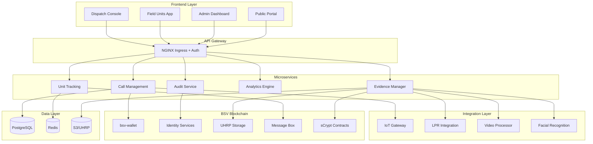
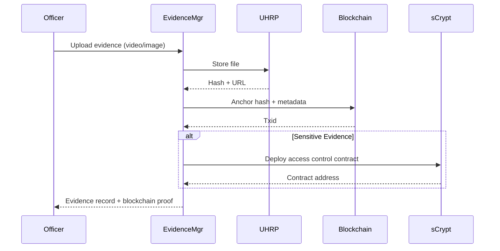
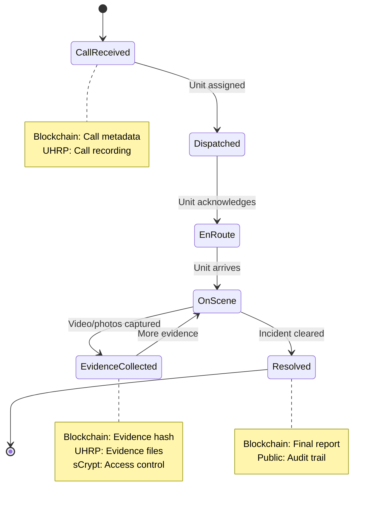

# CAD - Computer Aided Dispatcher for Emergency Services

> **Parent**: See `../WARP.md` (master map)  
> **Status**: 🔴 Proposed  
> **Priority**: P1 (High)  
> **Tech Stack**: TypeScript (NestJS), Python (Analytics), React, PostgreSQL, Redis, sCrypt

---

## 📋 Table of Contents

1. [Project Overview](#project-overview)
2. [Problem Statement](#problem-statement)
3. [Solution Architecture](#solution-architecture)
4. [BSV Integrations](#bsv-integrations)
5. [System Components](#system-components)
6. [Data Flow](#data-flow)
7. [Implementation Roadmap](#implementation-roadmap)
8. [Security & Privacy](#security--privacy)

---

## 🎯 Project Overview

**CAD (Computer Aided Dispatcher)** es un sistema integral para servicios de emergencia (911, policía, bomberos, ambulancia) que utiliza blockchain BSV para garantizar transparencia, auditabilidad y cadena de custodia digital de evidencia.

### Key Features

- **911 Dispatch**: Gestión de llamadas de emergencia con logs inmutables
- **Video/IoT Integration**: Cámaras de seguridad, semáforos inteligentes, botones de pánico
- **LPR (License Plate Recognition)**: Lectores automáticos de placas vehiculares
- **VA/FR (Video Analytics/Facial Recognition)**: Análisis en tiempo real con registro blockchain
- **Digital Chain of Custody**: Cadena de custodia para evidencia legal
- **Real-time Coordination**: Coordinación P2P encriptada entre unidades
- **Public Audit Trail**: Auditorías transparentes con privacidad selectiva

---

## 🚨 Problem Statement

### Problemas Actuales en Sistemas de Emergencia

1. **Falta de Transparencia**:
   - Logs modificables/eliminables
   - Sin auditoría independiente
   - Corrupción de evidencia

2. **Coordinación Ineficiente**:
   - Comunicación fragmentada
   - Información desactualizada
   - Falta de contexto en tiempo real

3. **Cadena de Custodia Débil**:
   - Evidencia manipulable
   - Sin timestamps verificables
   - Gaps en la trazabilidad

4. **Privacidad vs Transparencia**:
   - Todo público → viola privacidad
   - Todo privado → permite corrupción
   - Necesidad de divulgación selectiva

---

## 🏗️ Solution Architecture

### High-Level Architecture



---

## 🔗 BSV Integrations

### 1. UHRP Services (Storage)

**Purpose**: Store video, images, audio with blockchain anchoring

```typescript
// Evidence upload with UHRP
class EvidenceStorage {
  async storeEvidence(
    file: File,
    metadata: {
      incidentId: string
      timestamp: Date
      officerId: string
      type: 'video' | 'image' | 'audio'
    }
  ): Promise<EvidenceRecord> {
    // Upload to UHRP
    const uhrpResponse = await this.uhrpClient.uploadContent(file, {
      type: metadata.type,
      name: `${metadata.incidentId}_${metadata.timestamp.toISOString()}`
    }, true) // anchor=true
    
    // Create blockchain record
    const tx = await this.wallet.createTransaction({
      data: {
        incidentId: metadata.incidentId,
        evidenceHash: uhrpResponse.hash,
        timestamp: metadata.timestamp,
        officer: metadata.officerId,
        uhrp: uhrpResponse.uhrp
      }
    })
    
    return {
      id: uuidv4(),
      uhrpHash: uhrpResponse.hash,
      uhrpUrl: uhrpResponse.url,
      blockchainTxid: tx.txid,
      metadata
    }
  }
}
```

### 2. Identity Services (Authorization)

**Purpose**: Verify authorized personnel with DIDs

```typescript
// Officer authentication with DID
class OfficerAuth {
  async authenticateOfficer(
    pubkey: string,
    signature: string
  ): Promise<OfficerIdentity> {
    // Resolve identity
    const identity = await this.identityClient.resolve(pubkey)
    
    // Verify credentials
    const credentials = identity.certificates.filter(c => 
      c.type === 'law_enforcement' && 
      c.verified === true &&
      c.expiresAt > Date.now()
    )
    
    if (credentials.length === 0) {
      throw new Error('No valid law enforcement credentials')
    }
    
    // Check signature
    const valid = await this.verifySignature(pubkey, signature)
    if (!valid) {
      throw new Error('Invalid signature')
    }
    
    return {
      pubkey,
      name: identity.name,
      badgeNumber: credentials[0].badgeNumber,
      department: credentials[0].department,
      rank: credentials[0].rank
    }
  }
}
```

### 3. Message Box (P2P Coordination)

**Purpose**: Encrypted communication between units

```typescript
// Unit-to-unit messaging
class DispatchMessaging {
  async sendToUnit(
    unitId: string,
    message: {
      type: 'dispatch' | 'backup_request' | 'status_update'
      priority: 'low' | 'medium' | 'high' | 'critical'
      content: string
      location?: { lat: number, lng: number }
    }
  ) {
    // Get unit's public key
    const unit = await this.getUnitInfo(unitId)
    
    // Encrypt and send via Message Box
    await this.messageBoxClient.sendMessage(
      unit.pubkey,
      JSON.stringify({
        ...message,
        timestamp: Date.now(),
        sender: this.currentOfficer.pubkey
      })
    )
    
    // Log to blockchain (metadata only)
    await this.wallet.createTransaction({
      data: {
        type: 'message',
        to: unitId,
        messageType: message.type,
        priority: message.priority,
        timestamp: Date.now()
        // NO incluir contenido (privacidad)
      }
    })
  }
}
```

### 4. sCrypt Contracts (Access Control)

**Purpose**: Multisig access to sensitive evidence

```typescript
// sCrypt contract for evidence access
class EvidenceAccessControl extends SmartContract {
  @prop()
  evidenceHash: Sha256
  
  @prop()
  requiredSignatures: number // e.g., 3
  
  @prop()
  authorizedPubkeys: FixedArray<PubKey, 5> // Supervisor, Chief, DA, Judge, IA
  
  @method()
  public unlock(
    signatures: FixedArray<Sig, 3>,
    signerIndices: FixedArray<bigint, 3>
  ) {
    // Verify each signature
    for (let i = 0; i < this.requiredSignatures; i++) {
      const pubkey = this.authorizedPubkeys[Number(signerIndices[i])]
      assert(
        this.checkSig(signatures[i], pubkey),
        'Invalid signature'
      )
    }
    
    // Additional checks (e.g., timelock for warrant expiry)
    assert(
      this.ctx.locktime < 1735689600n, // Warrant expiry
      'Warrant expired'
    )
  }
}
```

### 5. Teranode (IoT Scaling)

**Integration Pattern**: Batch IoT events for massive throughput

```typescript
// IoT event batcher for Teranode
class IoTEventBatcher {
  private queue: IoTEvent[] = []
  private batchSize = 1000
  private flushInterval = 10000 // 10s
  
  async recordEvent(event: {
    deviceId: string
    type: 'camera' | 'lpr' | 'panic_button' | 'traffic_light'
    data: any
    location: { lat: number, lng: number }
    timestamp: Date
  }) {
    this.queue.push(event)
    
    if (this.queue.length >= this.batchSize) {
      await this.flush()
    }
  }
  
  private async flush() {
    if (this.queue.length === 0) return
    
    const batch = this.queue.splice(0, this.batchSize)
    
    // Create single transaction with all events
    const tx = await this.wallet.createTransaction({
      data: {
        type: 'iot_batch',
        count: batch.length,
        merkleRoot: this.computeMerkleRoot(batch),
        timestamp: Date.now()
      }
    })
    
    // Store full data off-chain (UHRP) with blockchain anchor
    await this.uhrpClient.uploadContent(
      new Blob([JSON.stringify(batch)]),
      { type: 'iot_batch', txid: tx.txid },
      false // Don't anchor again
    )
  }
}
```

---

## 🧩 System Components

### 1. Call Management Service

**Responsibilities**:
- 911 call intake and routing
- Incident creation and tracking
- Priority management
- Call recording with blockchain timestamps

**Database Schema**:
```sql
CREATE TABLE incidents (
    id UUID PRIMARY KEY,
    call_timestamp TIMESTAMP NOT NULL,
    caller_phone VARCHAR(20),
    location_lat DECIMAL(10, 8),
    location_lng DECIMAL(11, 8),
    type VARCHAR(50), -- fire, medical, police, etc.
    priority VARCHAR(10), -- critical, high, medium, low
    status VARCHAR(20), -- dispatched, en_route, on_scene, resolved
    blockchain_txid VARCHAR(64) NOT NULL,
    created_at TIMESTAMP DEFAULT NOW()
);

CREATE TABLE incident_updates (
    id UUID PRIMARY KEY,
    incident_id UUID REFERENCES incidents(id),
    officer_pubkey VARCHAR(66),
    update_type VARCHAR(50),
    notes TEXT,
    blockchain_txid VARCHAR(64),
    timestamp TIMESTAMP DEFAULT NOW()
);
```

### 2. Unit Tracking Service

**Responsibilities**:
- Real-time location tracking of units
- Status updates (available, dispatched, on_scene, etc.)
- Route optimization
- Geofencing and alerts

**Redis Data Structures**:
```typescript
// Real-time unit positions (Redis GEO)
GEOADD units:active <lng> <lat> <unit_id>

// Unit status (Redis Hash)
HSET unit:<unit_id> status available
HSET unit:<unit_id> last_update 1699999999
HSET unit:<unit_id> current_incident <incident_id>
```

### 3. Evidence Manager Service

**Responsibilities**:
- Evidence upload and storage (UHRP)
- Chain of custody tracking
- Access control (sCrypt multisig)
- Metadata indexing

**Workflow**:


### 4. Analytics Engine (Python)

**Responsibilities**:
- Pattern detection (crime hotspots, response times)
- Facial recognition processing
- LPR data analysis
- Predictive policing (ethical considerations)

**Technologies**:
- OpenCV for video processing
- TensorFlow/PyTorch for FR/LPR models
- PostGIS for spatial analysis
- TimescaleDB for time-series data

### 5. Audit Service

**Responsibilities**:
- Public audit trail generation
- Merkle proof verification
- Compliance reporting
- Transparency portal

---

## 🔄 Data Flow

### Incident Lifecycle



---

## 🗓️ Implementation Roadmap

### Phase 1: Core Infrastructure (Weeks 1-4)

- [ ] Set up microservices skeleton (NestJS)
- [ ] Integrate bsv-wallet for blockchain transactions
- [ ] Implement Call Management Service
- [ ] Basic Dispatch Console UI (React)
- [ ] PostgreSQL schema for incidents
- [ ] Unit testing for core services

**Deliverable**: Working dispatch console for call intake

### Phase 2: BSV Integration (Weeks 5-8)

- [ ] UHRP client for evidence storage
- [ ] Identity Services integration for officer auth
- [ ] Message Box integration for P2P messaging
- [ ] Blockchain anchoring for all events
- [ ] Merkle proof generation

**Deliverable**: Evidence upload with blockchain verification

### Phase 3: Advanced Features (Weeks 9-12)

- [ ] sCrypt multisig contracts for evidence access
- [ ] Unit Tracking Service with Redis GEO
- [ ] Field Units mobile app (React Native)
- [ ] Real-time coordination features
- [ ] Analytics dashboard

**Deliverable**: Full dispatch + field units coordination

### Phase 4: IoT Integration (Weeks 13-16)

- [ ] IoT Gateway for cameras/sensors
- [ ] LPR integration with batch processing
- [ ] Video Analytics pipeline (Python)
- [ ] Facial Recognition (with ethical safeguards)
- [ ] Teranode batch processing for IoT events

**Deliverable**: Real-time IoT event processing

### Phase 5: Audit & Compliance (Weeks 17-20)

- [ ] Public Audit Portal
- [ ] Merkle proof verification UI
- [ ] Compliance reporting tools
- [ ] ZKP for witness privacy
- [ ] Performance optimization

**Deliverable**: Public transparency portal

### Phase 6: Production Deployment (Weeks 21-24)

- [ ] Security audit
- [ ] Load testing (1M+ events/day)
- [ ] Kubernetes deployment
- [ ] Monitoring (Prometheus + Grafana)
- [ ] Documentation and training

**Deliverable**: Production-ready CAD system

---

## 🔐 Security & Privacy

### Threat Model

**Threats**:
1. Unauthorized access to evidence
2. Evidence tampering
3. Privacy violations (witness exposure)
4. Officer location tracking by adversaries
5. Denial of service attacks

**Mitigations**:
1. **sCrypt Multisig**: 3-of-5 for sensitive evidence access
2. **Blockchain Anchoring**: Immutable timestamps and hashes
3. **ZKP for Witnesses**: Zero-knowledge proofs for anonymous testimony
4. **Encrypted Messaging**: E2E encryption via Message Box
5. **Rate Limiting + DDoS Protection**: NGINX + Cloudflare

### Privacy by Design

**Public Data** (audit trail):
- Incident type and location (generalized to 100m grid)
- Response times
- Officer presence (yes/no, not identity)
- Evidence exists (hash, not content)

**Private Data** (access controlled):
- Officer identities
- Witness testimonies
- Full evidence (video/images)
- Exact locations
- Communication content

**Selective Disclosure**:
- Court orders → sCrypt multisig unlocks evidence
- Public records requests → Merkle proofs without sensitive data
- Internal affairs → Full access with audit trail

---

## 📊 Success Metrics

- **Response Time**: <5 minutes average (down from 8)
- **Evidence Integrity**: 100% blockchain-verified
- **Audit Trail**: 100% coverage of events
- **Public Trust**: Measurable via surveys
- **System Uptime**: 99.9%+ availability
- **Throughput**: 10,000+ events/second (IoT)

---

## 🔗 Related Resources

- **bsv-wallet**: `../bsv-wallet/WARP.md`
- **UHRP Services**: `../resources/teranode/uhrp-services/`
- **Identity Services**: `../resources/teranode/identity-services/`
- **Message Box**: `../resources/teranode/message-box-server/`
- **sCrypt Contracts**: `../resources/scrypt-cli/`

---

**Status**: 🔴 Proposed  
**Next Step**: Validate architecture with law enforcement stakeholders  
**Updated**: 2025-11-02 23:05 CST
