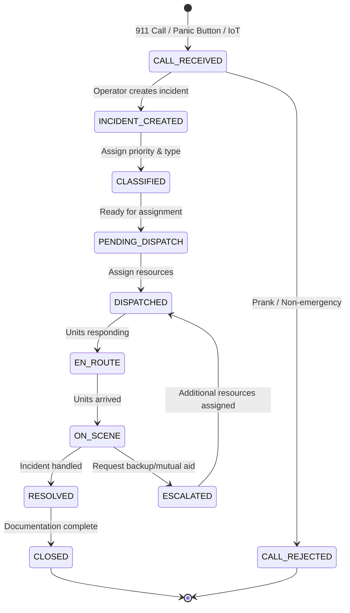
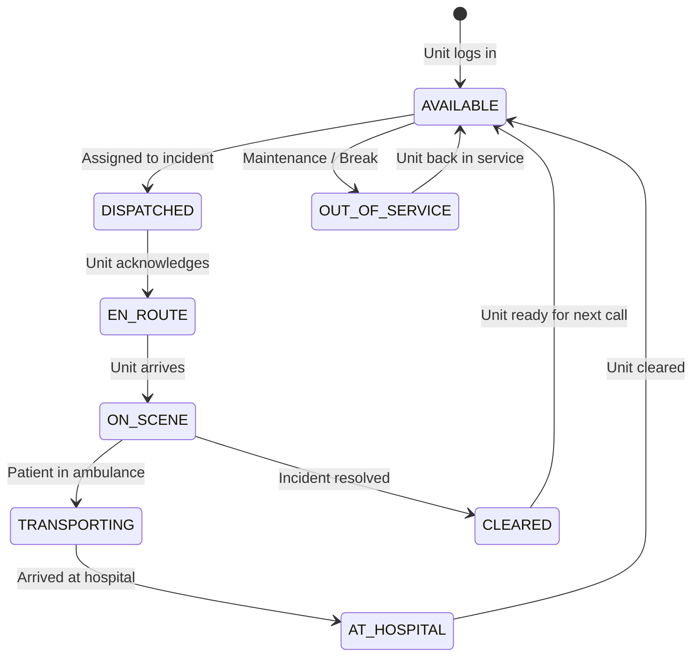

# Incident Management System - Design Document

**Status**: 🔄 Design Phase  
**Standards**: NENA i3, APCO CAD-to-CAD, BSV Event Sourcing  
**Generated**: 2025-11-03 06:36 CST

---

## 📋 Overview

El **Incident Management System** es el núcleo del CAD. Gestiona el ciclo de vida completo de incidentes de emergencia desde la recepción de llamadas hasta la resolución final, incluyendo clasificación, despacho de recursos, interoperabilidad multi-agencia, y auditoría blockchain.

---

## 🌐 Industry Standards Research

### NENA i3 Standard (National Emergency Number Association)

**Purpose**: Next Generation 911 (NG911) architecture

**Key Components**:
- **ESInet** (Emergency Services IP Network) - IP-based emergency services network
- **Incident ID** - Globally unique incident identifier
- **Location** - GIS coordinates + civic address
- **Call Data** - ANI/ALI (Automatic Number/Location Identification)
- **Additional Data** - Photos, video, sensor data from callers
- **Interoperability** - PSAP-to-PSAP incident transfer

**Relevance to BSV**:
- ✅ Incident ID → blockchain txid (globally unique)
- ✅ Location → GIS coordinates in OP_RETURN
- ✅ Additional Data → UHRP content-addressed storage
- ✅ Interoperability → sCrypt multi-agency contracts

**Reference**: [NENA i3 Architecture](https://www.nena.org/page/i3_Stage3)

---

### APCO CAD-to-CAD Interoperability

**Purpose**: Share incidents across jurisdictions (city, county, state, federal)

**Key Features**:
- **Incident Transfer** - Transfer incident ownership between PSAPs
- **Mutual Aid** - Request resources from neighboring agencies
- **Automatic Vehicle Location (AVL)** - Share unit positions
- **Status Updates** - Real-time incident status across agencies

**Relevance to BSV**:
- ✅ Incident Transfer → sCrypt contract ownership transfer
- ✅ Mutual Aid → blockchain resource request + approval flow
- ✅ AVL → GPS coordinates in blockchain events
- ✅ Status Updates → event sourcing state machine

**Reference**: [APCO Standards](https://www.apcointl.org/standards/)

---

### CAD Incident Lifecycle (Industry Standard)



**States**:
1. **CALL_RECEIVED** - Incoming call logged
2. **INCIDENT_CREATED** - Operator confirms emergency
3. **CLASSIFIED** - Priority (P1-P5) + Type (Fire, Medical, Police, etc.)
4. **PENDING_DISPATCH** - Awaiting resource assignment
5. **DISPATCHED** - Resources assigned
6. **EN_ROUTE** - Units responding
7. **ON_SCENE** - Units arrived at location
8. **ESCALATED** - Backup/mutual aid requested
9. **RESOLVED** - Incident handled
10. **CLOSED** - Final report submitted

---

## 🏗️ BSV Event Sourcing Architecture

### Principle: State Machine as Blockchain Transactions

**Legacy (mutable)**:
```sql
-- PostgreSQL (mutable state)
UPDATE incidents SET status = 'DISPATCHED' WHERE id = 12345;
```

**BSV (immutable)**:
```typescript
// Blockchain (event sourcing)
const event = {
  type: 'incident_dispatched',
  incidentId: 'inc-12345',
  resources: ['unit-42', 'unit-99'],
  timestamp: Date.now()
};
await blockchain.logEvent(event); // Immutable, auditable
```

**Key Difference**: No UPDATE, only APPEND. Current state = reduce(all events).

---

### Event Types (Complete Lifecycle)

```typescript
// 1. Call Reception
type CallReceivedEvent = {
  type: 'call_received';
  callId: string;
  callerPhone: string;
  callerLocation: { lat: number; lng: number };
  ani: string; // Automatic Number Identification
  ali: string; // Automatic Location Identification
  timestamp: Date;
  operatorDID: DID;
};

// 2. Incident Creation
type IncidentCreatedEvent = {
  type: 'incident_created';
  incidentId: string;
  callId: string;
  location: { lat: number; lng: number; address: string };
  description: string;
  operatorDID: DID;
  timestamp: Date;
};

// 3. Classification
type IncidentClassifiedEvent = {
  type: 'incident_classified';
  incidentId: string;
  priority: 'P1' | 'P2' | 'P3' | 'P4' | 'P5'; // P1 = life-threatening
  category: 'FIRE' | 'MEDICAL' | 'POLICE' | 'RESCUE' | 'HAZMAT';
  subcategory: string; // e.g., "Structure Fire", "Cardiac Arrest"
  operatorDID: DID;
  timestamp: Date;
};

// 4. Dispatch
type IncidentDispatchedEvent = {
  type: 'incident_dispatched';
  incidentId: string;
  resources: ResourceAssignment[];
  dispatcherDID: DID;
  timestamp: Date;
};

// 5. Unit Response
type UnitEnRouteEvent = {
  type: 'unit_en_route';
  incidentId: string;
  unitId: string;
  timestamp: Date;
};

type UnitOnSceneEvent = {
  type: 'unit_on_scene';
  incidentId: string;
  unitId: string;
  arrivalTime: Date;
  location: { lat: number; lng: number };
};

// 6. Escalation
type IncidentEscalatedEvent = {
  type: 'incident_escalated';
  incidentId: string;
  reason: 'BACKUP_NEEDED' | 'MUTUAL_AID' | 'SPECIALIZED_UNIT';
  requestingAgency: string;
  targetAgency: string;
  timestamp: Date;
};

// 7. Resolution
type IncidentResolvedEvent = {
  type: 'incident_resolved';
  incidentId: string;
  resolution: 'HANDLED' | 'CANCELLED' | 'FALSE_ALARM' | 'REFERRED';
  notes: string;
  timestamp: Date;
};

// 8. Closure
type IncidentClosedEvent = {
  type: 'incident_closed';
  incidentId: string;
  finalReport: string;
  evidenceHashes: string[]; // UHRP hashes
  closedBy: DID;
  timestamp: Date;
};

// Union type
type IncidentEvent =
  | CallReceivedEvent
  | IncidentCreatedEvent
  | IncidentClassifiedEvent
  | IncidentDispatchedEvent
  | UnitEnRouteEvent
  | UnitOnSceneEvent
  | IncidentEscalatedEvent
  | IncidentResolvedEvent
  | IncidentClosedEvent;
```

---

### State Reconstruction

```typescript
// Reconstruct current state from all events
class IncidentState {
  static reduce(events: IncidentEvent[]): CurrentIncidentState {
    const state: CurrentIncidentState = {
      incidentId: '',
      status: 'CALL_RECEIVED',
      priority: undefined,
      location: undefined,
      assignedResources: [],
      timeline: []
    };

    for (const event of events) {
      switch (event.type) {
        case 'incident_created':
          state.incidentId = event.incidentId;
          state.status = 'INCIDENT_CREATED';
          state.location = event.location;
          break;

        case 'incident_classified':
          state.priority = event.priority;
          state.category = event.category;
          state.status = 'CLASSIFIED';
          break;

        case 'incident_dispatched':
          state.assignedResources = event.resources;
          state.status = 'DISPATCHED';
          break;

        case 'unit_on_scene':
          state.status = 'ON_SCENE';
          break;

        case 'incident_resolved':
          state.status = 'RESOLVED';
          break;

        case 'incident_closed':
          state.status = 'CLOSED';
          break;
      }

      state.timeline.push(event);
    }

    return state;
  }
}
```

**Query Example**:
```typescript
// Get current incident status
const events = await blockchain.queryEvents({ incidentId: 'inc-12345' });
const currentState = IncidentState.reduce(events);
console.log(currentState.status); // "ON_SCENE"
```

---

## 🔗 Multi-Agency Interoperability

### Use Case: Cross-Jurisdiction Incident

**Scenario**: 
- Fire starts in City A (jurisdiction)
- Fire spreads to City B (neighboring jurisdiction)
- City A requests mutual aid from City B

### sCrypt Multi-Agency Contract

```typescript
// Incident ownership contract
class IncidentOwnershipContract extends SmartContract {
  @prop()
  incidentId: string;

  @prop()
  primaryAgency: PubKey; // City A public key

  @prop()
  authorizedAgencies: PubKey[]; // [City A, City B]

  @prop()
  requiresApproval: boolean; // true for cross-jurisdiction

  @method()
  public transferOwnership(
    newOwner: PubKey,
    sig: Sig // Signature from primaryAgency
  ) {
    // Verify signature from primary agency
    assert(
      this.checkSig(sig, this.primaryAgency),
      'Invalid signature'
    );

    // Verify new owner is authorized
    assert(
      this.authorizedAgencies.includes(newOwner),
      'Unauthorized agency'
    );

    // Transfer ownership
    this.primaryAgency = newOwner;
  }

  @method()
  public addAuthorizedAgency(
    newAgency: PubKey,
    sig: Sig
  ) {
    assert(
      this.checkSig(sig, this.primaryAgency),
      'Only primary agency can authorize'
    );

    this.authorizedAgencies.push(newAgency);
  }
}
```

**Flow**:
1. City A creates incident → deploys contract with `primaryAgency = cityA`
2. City A requests mutual aid → calls `addAuthorizedAgency(cityB)`
3. City B dispatches resources → logs event to blockchain
4. City B takes over incident → calls `transferOwnership(cityB, sig)`
5. Both agencies see all events (shared blockchain audit trail)

---

## 👨‍💻 Operator & Supervisor Workflows

### Operator Actions (Logged to Blockchain)

```typescript
type OperatorAction =
  | { type: 'operator_login'; operatorDID: DID; shift: string }
  | { type: 'operator_logout'; operatorDID: DID; shift: string }
  | { type: 'call_answered'; callId: string; operatorDID: DID }
  | { type: 'call_transferred'; callId: string; fromOperator: DID; toOperator: DID }
  | { type: 'incident_note_added'; incidentId: string; note: string; operatorDID: DID };
```

**Metrics (Queryable)**:
- Calls handled per operator per shift
- Average call duration
- Average time-to-dispatch
- Incident resolution time

### Supervisor Overrides (sCrypt Enforcement)

```typescript
// Supervisor can override operator actions with signature
class SupervisorOverrideContract extends SmartContract {
  @prop()
  supervisorPubKey: PubKey;

  @method()
  public overrideIncidentPriority(
    incidentId: string,
    newPriority: string,
    sig: Sig
  ) {
    assert(
      this.checkSig(sig, this.supervisorPubKey),
      'Only supervisor can override'
    );

    // Log override event to blockchain
    // (external call via oracle or blockchain API)
  }
}
```

**Use Cases**:
- Supervisor escalates incident priority (P3 → P1)
- Supervisor reassigns resources
- Supervisor closes incident early (e.g., duplicate)

---

## 🚗 Resource Allocation System

### Resource State Machine



### Resource Events

```typescript
type ResourceEvent =
  | { type: 'unit_login'; unitId: string; shift: string; location: GeoLocation }
  | { type: 'unit_logout'; unitId: string }
  | { type: 'unit_dispatched'; unitId: string; incidentId: string }
  | { type: 'unit_en_route'; unitId: string; incidentId: string }
  | { type: 'unit_on_scene'; unitId: string; incidentId: string; arrivalTime: Date }
  | { type: 'unit_cleared'; unitId: string; incidentId: string }
  | { type: 'unit_out_of_service'; unitId: string; reason: string };
```

### GPS Tracking (Blockchain Events)

```typescript
// IoT device (vehicle GPS) → blockchain every 30 seconds
type GPSUpdateEvent = {
  type: 'gps_update';
  unitId: string;
  location: { lat: number; lng: number; heading: number; speed: number };
  timestamp: Date;
};

// Query recent position
const gpsEvents = await blockchain.queryEvents({
  type: 'gps_update',
  unitId: 'unit-42',
  since: Date.now() - 5 * 60 * 1000 // Last 5 minutes
});

const currentPosition = gpsEvents[gpsEvents.length - 1].location;
```

**Benefit**: Full vehicle tracking history on blockchain (immutable proof of location).

---

## 🚨 Panic Button → Incident Flow

### Use Case: Officer Panic Button

**Scenario**:
1. Officer presses panic button on radio
2. IoT device sends signal → blockchain
3. System automatically:
   - Creates P1 incident
   - Indexes nearby cameras
   - Starts recording video
   - Dispatches backup units
   - Notifies supervisor

### Implementation

```typescript
class PanicButtonHandler {
  async handlePanicButton(event: PanicButtonEvent) {
    // 1. Create P1 incident
    const incident = await this.incidentManager.createIncident({
      type: 'PANIC_BUTTON',
      priority: 'P1', // Highest priority
      location: event.officerLocation,
      description: `Officer ${event.officerBadge} panic button activated`,
      sourceDeviceId: event.deviceId
    });

    // 2. Index nearby cameras (within 500m radius)
    const cameras = await this.cameraService.findNearby({
      location: event.officerLocation,
      radius: 500 // meters
    });

    // 3. Start recording all nearby cameras
    const recordings = await Promise.all(
      cameras.map(camera =>
        this.videoAdapter.recordCamera({
          cameraId: camera.id,
          incidentId: incident.id,
          duration: 300 // 5 minutes
        })
      )
    );

    // 4. Anchor camera footage to blockchain
    for (const recording of recordings) {
      await this.blockchainLogger.logEvent({
        type: 'camera_indexed',
        incidentId: incident.id,
        cameraId: recording.cameraId,
        uhrpHash: recording.uhrpHash,
        autoTriggered: true,
        triggerSource: 'panic_button'
      });
    }

    // 5. Dispatch nearest available backup units
    const nearestUnits = await this.resourceManager.findNearest({
      location: event.officerLocation,
      count: 3,
      status: 'AVAILABLE'
    });

    await this.incidentManager.dispatch({
      incidentId: incident.id,
      resources: nearestUnits.map(u => u.id)
    });

    // 6. Notify supervisor via Message Box
    await this.messagingAdapter.sendMessage(
      'did:bsv:system',
      event.supervisorDID,
      `PANIC BUTTON: Officer ${event.officerBadge} at ${event.officerLocation.address}`
    );

    return incident;
  }
}
```

**Timeline**:
```
T+0s:   Panic button pressed
T+1s:   Incident created on blockchain (P1)
T+2s:   5 nearby cameras indexed
T+3s:   Video recording started (all cameras)
T+5s:   3 backup units dispatched
T+6s:   Supervisor notified
T+120s: First unit arrives on scene
```

---

## 📊 Legacy Service Mapping

### Current Microservices → BSV Events

| Legacy Service | Function | BSV Replacement |
|----------------|----------|-----------------|
| **llamada-incidente** | Create incident from call | `IncidentCreatedEvent` transaction |
| **llamada-real** | Mark call as real emergency | `IncidentClassifiedEvent` with priority |
| **llamada-recurrente** | Tag recurring caller | DID-based caller history query |
| **llamada-no-procedente** | Mark call as non-emergency | `CallRejectedEvent` transaction |
| **recibir-incidente** | Log incoming incident | `CallReceivedEvent` transaction |
| **despacho-evento** | Dispatch resources | `IncidentDispatchedEvent` transaction |
| **macro-evento** | Multi-incident event (e.g., riot) | Parent incident with child incidents |
| **medio-incidente** | Resource assignment | `ResourceAssignment` in dispatch event |
| **emergencia-externa** | External agency incident | `IncidentEscalatedEvent` with agency transfer |
| **consulta-incidente** | Query incidents | SPV indexer query by incidentId |
| **información-incidente** | Get incident details | Event sourcing reduce(all events) |
| **datos-complementarios** | Additional incident data | Append-only `IncidentNoteAddedEvent` |
| **grid-llamada** | Call dashboard | Real-time SPV indexer UI |
| **supervisor-*** | Supervisor actions | Supervisor DID-signed override events |
| **recurso-asignado** | Assigned resources | Query `ResourceAssignment` events |
| **eventos-cercanos** | Nearby incidents | GIS query on incident locations |
| **gps-cad** | GPS tracking | `GPSUpdateEvent` stream |

**Consolidation**: 15 microservices → **1 IncidentManager** + **Blockchain Event Store**

---

## 🔍 Query Patterns

### 1. Get Active Incidents

```typescript
const activeIncidents = await indexer.query({
  eventType: 'incident_*',
  status: ['DISPATCHED', 'EN_ROUTE', 'ON_SCENE'],
  since: Date.now() - 24 * 60 * 60 * 1000 // Last 24 hours
});
```

### 2. Get Incident Timeline

```typescript
const events = await blockchain.queryEvents({
  incidentId: 'inc-12345',
  orderBy: 'timestamp ASC'
});

const timeline = events.map(e => ({
  time: e.timestamp,
  action: e.type,
  actor: e.actorDID
}));
```

### 3. Get Operator Performance

```typescript
const operatorEvents = await blockchain.queryEvents({
  actorDID: 'did:bsv:operator-001',
  since: shiftStartTime,
  until: shiftEndTime
});

const metrics = {
  callsHandled: operatorEvents.filter(e => e.type === 'call_answered').length,
  incidentsCreated: operatorEvents.filter(e => e.type === 'incident_created').length,
  avgResponseTime: calculateAvg(operatorEvents, 'call_answered')
};
```

### 4. Get Nearby Incidents (GIS)

```typescript
const nearbyIncidents = await indexer.queryGIS({
  location: { lat: 19.4326, lng: -99.1332 },
  radius: 5000, // 5km
  status: ['ACTIVE']
});
```

---

## 🛡️ Security & Access Control

### Evidence Access (sCrypt Multisig)

```typescript
class IncidentEvidenceVault extends SmartContract {
  @prop()
  incidentId: string;

  @prop()
  evidenceHashes: string[]; // UHRP hashes

  @prop()
  authorizedPubKeys: PubKey[]; // [supervisor, chief, DA, judge, IA]

  @prop()
  requiredSignatures: number; // 3-of-5

  @method()
  public accessEvidence(
    evidenceHash: string,
    signatures: Sig[]
  ): boolean {
    // Verify required number of signatures
    assert(
      signatures.length >= this.requiredSignatures,
      'Insufficient signatures'
    );

    // Verify all signatures are from authorized pubkeys
    for (let i = 0; i < signatures.length; i++) {
      const valid = this.checkSig(signatures[i], this.authorizedPubKeys[i]);
      assert(valid, `Invalid signature ${i}`);
    }

    // Grant access (log to blockchain)
    return true;
  }
}
```

**Use Case**: 
- District Attorney requests evidence for prosecution
- Requires 3 signatures: Supervisor + Chief + Judge
- All access logged to blockchain (audit trail)

---

## 📈 Migration Strategy

### Phase 1: Dual-Write (Months 1-3)

```typescript
class HybridIncidentManager {
  async createIncident(data: IncidentData) {
    // 1. Write to legacy (PostgreSQL)
    const legacyIncident = await this.legacyDB.incidents.create(data);

    // 2. Write to blockchain
    const event: IncidentCreatedEvent = {
      type: 'incident_created',
      incidentId: legacyIncident.id,
      ...data,
      timestamp: new Date()
    };

    const txid = await this.blockchain.logEvent(event);

    return { legacyId: legacyIncident.id, blockchainTxid: txid };
  }
}
```

### Phase 2: Read from Blockchain (Months 4-6)

```typescript
// Start reading from blockchain, write to both
const incident = await this.blockchain.getIncident(incidentId);
// Fallback to legacy if not in blockchain yet
if (!incident) {
  incident = await this.legacyDB.incidents.findOne({ id: incidentId });
}
```

### Phase 3: Blockchain Primary (Months 7-12)

```typescript
// Blockchain is source of truth, legacy is read-only
const incident = await this.blockchain.getIncident(incidentId);
// Legacy DB only for historical queries
```

### Phase 4: Full Cutover (Months 13-18)

```typescript
// Legacy DB decommissioned
const incident = await this.blockchain.getIncident(incidentId);
```

---

## 🎯 Next Steps

1. ✅ Complete design document
2. ⬜ Implement `IncidentManager` class (TypeScript)
3. ⬜ Implement event sourcing state machine
4. ⬜ Implement multi-agency sCrypt contracts
5. ⬜ Implement panic button handler
6. ⬜ Implement GPS tracking indexer
7. ⬜ Deploy POC with 100 test incidents
8. ⬜ Benchmark: 1000 concurrent incidents

---

**References**:
- NENA i3: https://www.nena.org/page/i3_Stage3
- APCO Standards: https://www.apcointl.org/standards/
- NG911: https://www.911.gov/
- BSV Event Sourcing: https://wiki.bitcoinsv.io/index.php/UTXO_Based_Validity_Tracking

**Status**: 📋 Design Complete, Implementation Pending  
**Estimated Effort**: 8-12 weeks for core IncidentManager + 4-6 weeks for integrations
