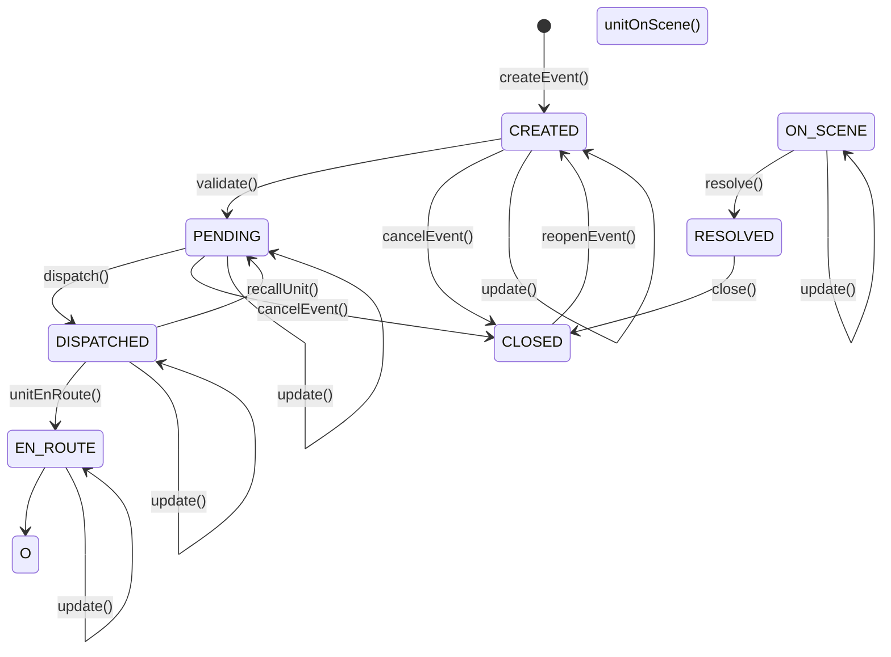

# Diseño de Event Sourcing para Incidentes en Blockchain

## 1. Conceptos fundamentales

### 1.1 UTXO como event sourcing
En Bitcoin SV, cada UTXO (Unspent Transaction Output) representa un estado inmutable. Para implementar event sourcing:

- **Estado actual** = UTXO actual sin gastar
- **Evento** = Transacción que consume UTXO anterior y crea UTXO nuevo
- **Historial completo** = Cadena de transacciones desde génesis del incidente

```
[Incident Created]     [Status Update]      [Dispatched]         [Closed]
      TX1          →        TX2          →       TX3          →     TX4
   UTXO₀ → UTXO₁        UTXO₁ → UTXO₂       UTXO₂ → UTXO₃      UTXO₃ → UTXO₄
```

### 1.2 Ventajas del modelo UTXO para CAD

**Inmutabilidad:** Cada estado anterior permanece en blockchain, auditable indefinidamente

**Concurrencia:** Múltiples UTXOs pueden actualizarse en paralelo sin conflictos

**Atomicidad:** Transacciones compuestas (ej: cerrar incidente + liberar recursos) son atómicas

**Trazabilidad:** Cadena de custody completa para evidencia legal

## 2. Mapeo de operaciones legacy a eventos blockchain

### 2.1 Create Incident

**Operación Legacy:**
```java
@Async
Future<EventCommand> createEvent(EventCommand eventCommand)
```

**Evento Blockchain:**
```typescript
interface IncidentCreatedEvent {
  type: 'INCIDENT_CREATED';
  timestamp: number;
  incidentId: string; // Derivado de TXID
  reason: string;
  priority: number;
  description: string;
  location: GeoLocation;
  origin: string; // CALL_911, PANIC_BUTTON, OFFICER_INITIATED
  reportedBy: string; // Public key del operador
  agencies: string[]; // Public keys de agencias asignadas
}
```

**Contrato sCrypt:**
```typescript
class IncidentContract extends SmartContract {
  @prop()
  incidentId: ByteString;
  
  @prop()
  status: bigint; // 0=CREATED, 1=PENDING, 2=DISPATCHED, ...
  
  @prop()
  priority: bigint;
  
  @prop()
  dataHash: ByteString; // Hash SHA256 de datos completos del incidente
  
  @prop()
  agencyPubKeys: FixedArray<PubKey, 10>; // Hasta 10 agencias
  
  @prop()
  operatorPubKey: PubKey;
  
  @method()
  public create(
    sig: Sig,
    incidentData: ByteString,
    newStatus: bigint
  ) {
    // Verificar firma del operador autorizado
    assert(this.checkSig(sig, this.operatorPubKey));
    
    // Verificar que el estado sea válido (CREATED = 0)
    assert(newStatus == 0n);
    
    // Verificar hash de datos
    assert(sha256(incidentData) == this.dataHash);
    
    // Crear output con nuevo estado
    const output: ByteString = this.buildStateOutput(...);
    assert(hash256(output) == this.ctx.hashOutputs);
  }
}
```

**Transacción:**
```
Inputs:
  [0] Funding UTXO (satoshis para fees)
  
Outputs:
  [0] IncidentContract UTXO (estado inicial)
      Script: IncidentContract{incidentId, status=0, ...}
      Satoshis: 1000
  [1] Change UTXO
      Script: P2PKH(operatorPubKey)
      Satoshis: remaining
```

### 2.2 Update Incident

**Operación Legacy:**
```java
void updateEvent(EventCommand eventCommand)
```

**Evento Blockchain:**
```typescript
interface IncidentUpdatedEvent {
  type: 'INCIDENT_UPDATED';
  timestamp: number;
  incidentId: string;
  changes: {
    description?: string;
    priority?: number;
    location?: GeoLocation;
  };
  updatedBy: string;
  previousStateRef: string; // TXID:VOUT del estado anterior
}
```

**Contrato sCrypt (método update):**
```typescript
class IncidentContract extends SmartContract {
  // ... propiedades anteriores
  
  @method()
  public update(
    sig: Sig,
    newDataHash: ByteString,
    newPriority: bigint
  ) {
    // Verificar firma de operador o supervisor
    assert(
      this.checkSig(sig, this.operatorPubKey) || 
      this.checkSig(sig, this.supervisorPubKey)
    );
    
    // Verificar que incidente no esté cerrado
    assert(this.status < 6n); // 6 = CLOSED
    
    // Construir output con datos actualizados
    let newState = this;
    newState.dataHash = newDataHash;
    newState.priority = newPriority;
    
    const output: ByteString = newState.buildStateOutput();
    assert(hash256(output) == this.ctx.hashOutputs);
  }
}
```

**Transacción:**
```
Inputs:
  [0] Previous IncidentContract UTXO (estado anterior)
  [1] Funding UTXO (fees)
  
Outputs:
  [0] IncidentContract UTXO (estado actualizado)
      Script: IncidentContract{..., dataHash=newHash, priority=newPriority}
      Satoshis: 1000
  [1] Change UTXO
```

### 2.3 Close Incident

**Operación Legacy:**
```java
void closeEvent(Long id, String additionalFields, Long idBranch, String description)
```

**Evento Blockchain:**
```typescript
interface IncidentClosedEvent {
  type: 'INCIDENT_CLOSED';
  timestamp: number;
  incidentId: string;
  duration: number; // Milisegundos desde creación
  closureReport: {
    description: string;
    additionalFields: Record<string, any>;
    closedBy: string;
    closingAgency: string;
  };
  finalStateRef: string;
}
```

**Contrato sCrypt (método close):**
```typescript
class IncidentContract extends SmartContract {
  @method()
  public close(
    sig: Sig,
    closureReportHash: ByteString,
    duration: bigint
  ) {
    // Verificar firma autorizada
    assert(this.checkSig(sig, this.operatorPubKey));
    
    // Verificar que no esté ya cerrado
    assert(this.status != 6n);
    
    // Actualizar estado a CLOSED
    let newState = this;
    newState.status = 6n;
    
    // Nota: Closure report se almacena en OP_RETURN
    // No es necesario en el contrato principal
    
    const output: ByteString = newState.buildStateOutput();
    assert(hash256(output) == this.ctx.hashOutputs);
  }
}
```

**Transacción:**
```
Inputs:
  [0] Previous IncidentContract UTXO
  
Outputs:
  [0] IncidentContract UTXO (status=CLOSED)
      Satoshis: 1000
  [1] OP_RETURN (closure report data)
      Data: {closureReportHash, description, duration, ...}
      Satoshis: 0
```

### 2.4 Split Incident

**Operación Legacy:**
```java
EventCommand splitEvent(Long id)
```

**Evento Blockchain:**
```typescript
interface IncidentSplitEvent {
  type: 'INCIDENT_SPLIT';
  timestamp: number;
  originalIncidentId: string;
  newIncidentId: string; // TXID del nuevo incidente
  copiedData: {
    reason: string;
    priority: number;
    location: GeoLocation;
    agencies: string[];
  };
  splitBy: string;
}
```

**Transacción:**
```
Inputs:
  [0] Original IncidentContract UTXO
  [1] Funding UTXO
  
Outputs:
  [0] Original IncidentContract UTXO (actualizado con referencia a split)
  [1] New IncidentContract UTXO (clonado)
      Script: IncidentContract{newIncidentId, status=0, ...}
      Satoshis: 1000
  [2] OP_RETURN (split metadata)
      Data: {originalId, newId, reason: "SPLIT"}
  [3] Change UTXO
```

### 2.5 Combine Incidents

**Operación Legacy:**
```java
void combineEvent(Long idSourceEvent, Long idDestinationEvent, Long idSourceBranch)
```

**Evento Blockchain:**
```typescript
interface IncidentsCombinedEvent {
  type: 'INCIDENTS_COMBINED';
  timestamp: number;
  sourceIncidentId: string;
  destinationIncidentId: string;
  closingAgency: string;
  combinedBy: string;
}
```

**Transacción atómica:**
```
Inputs:
  [0] Source IncidentContract UTXO
  [1] Destination IncidentContract UTXO
  [2] Funding UTXO
  
Outputs:
  [0] Source IncidentContract UTXO (status=CLOSED)
  [1] Destination IncidentContract UTXO (con referencia a source)
  [2] IncidentRelationContract UTXO (tipo=COMBINE)
      Script: IncidentRelationContract{sourceId, destId, type=COMBINE}
      Satoshis: 1000
  [3] OP_RETURN (combine metadata)
  [4] Change UTXO
```

### 2.6 Relate Incidents

**Operación Legacy:**
```java
void relateEvent(Long idSourceEvent, Long idDestinationEvent)
```

**Transacción:**
```
Inputs:
  [0] Source IncidentContract UTXO
  [1] Destination IncidentContract UTXO
  [2] Funding UTXO
  
Outputs:
  [0] Source IncidentContract UTXO (sin cambio, solo lectura)
  [1] Destination IncidentContract UTXO (sin cambio, solo lectura)
  [2] IncidentRelationContract UTXO (tipo=RELATE)
  [3] Change UTXO
```

### 2.7 Extend Incident (Parent-Child)

**Operación Legacy:**
```java
void extendEvent(Long idSourceEvent, Long idDestinationEvent)
```

**Transacción:**
```
Inputs:
  [0] Parent IncidentContract UTXO
  [1] Child IncidentContract UTXO
  
Outputs:
  [0] Parent IncidentContract UTXO (incrementar child counter)
  [1] Child IncidentContract UTXO (agregar parentId)
  [2] IncidentRelationContract UTXO (tipo=PARENT)
```

### 2.8 Assign/Unassign Agencies

**Operación Legacy:**
```java
void assignBranches(EventCommand eventCommand)
void unassignBranches(EventCommand eventCommand)
```

**Evento Blockchain:**
```typescript
interface AgenciesAssignedEvent {
  type: 'AGENCIES_ASSIGNED';
  timestamp: number;
  incidentId: string;
  addedAgencies: string[];
  removedAgencies: string[];
  assignedBy: string;
}
```

**Transacción:**
```
Inputs:
  [0] IncidentContract UTXO
  [1+] AgencyContract UTXOs (una por agencia asignada)
  
Outputs:
  [0] IncidentContract UTXO (actualizar agencyPubKeys array)
  [1+] AgencyContract UTXOs (actualizar incidentIds array)
  [N] OP_RETURN (agency assignment metadata)
```

## 3. Máquina de estados del incidente

### 3.1 Estados y transiciones



### 3.2 Validación de transiciones en contrato

```typescript
class IncidentContract extends SmartContract {
  @method()
  validateTransition(currentStatus: bigint, newStatus: bigint): boolean {
    // Matriz de transiciones válidas
    const validTransitions: Map<bigint, bigint[]> = new Map([
      [0n, [1n, 6n]], // CREATED → PENDING, CLOSED
      [1n, [2n, 6n]], // PENDING → DISPATCHED, CLOSED
      [2n, [1n, 3n]], // DISPATCHED → PENDING, EN_ROUTE
      [3n, [4n]],     // EN_ROUTE → ON_SCENE
      [4n, [5n]],     // ON_SCENE → RESOLVED
      [5n, [6n]],     // RESOLVED → CLOSED
      [6n, [0n]]      // CLOSED → CREATED (reopen)
    ]);
    
    const allowed = validTransitions.get(currentStatus);
    return allowed ? allowed.includes(newStatus) : false;
  }
  
  @method()
  public changeStatus(sig: Sig, newStatus: bigint) {
    assert(this.checkSig(sig, this.operatorPubKey));
    
    // Validar transición de estado
    assert(this.validateTransition(this.status, newStatus));
    
    // Actualizar estado
    let newState = this;
    newState.status = newStatus;
    
    const output = newState.buildStateOutput();
    assert(hash256(output) == this.ctx.hashOutputs);
  }
}
```

## 4. Estructura de datos en OP_RETURN

### 4.1 Formato de metadatos

Cada transacción de incidente incluye un OP_RETURN con metadatos estructurados:

```typescript
interface IncidentMetadata {
  version: number; // Versión del protocolo (1)
  eventType: string; // 'INCIDENT_CREATED', 'INCIDENT_UPDATED', etc.
  timestamp: number; // Unix timestamp en milisegundos
  incidentId: string; // TXID del incidente
  payload: any; // Datos específicos del evento
}
```

**Serialización:**
```typescript
const metadata: IncidentMetadata = {
  version: 1,
  eventType: 'INCIDENT_CREATED',
  timestamp: Date.now(),
  incidentId: tx.id,
  payload: {
    reason: 'ASSAULT',
    priority: 2,
    location: {lat: 19.432608, lng: -99.133209},
    agencies: ['AGY1', 'AGY2']
  }
};

const serialized = Buffer.from(JSON.stringify(metadata));
const opReturn = bsv.Script.buildSafeDataOut(serialized);
```

### 4.2 Indexación de metadatos

**Overlay network indexer:**
```typescript
class IncidentIndexer {
  async indexTransaction(tx: Transaction) {
    // Extraer OP_RETURN
    const opReturn = tx.outputs.find(o => o.script.isDataOut());
    if (!opReturn) return;
    
    // Deserializar metadata
    const metadata: IncidentMetadata = JSON.parse(
      opReturn.script.getData().toString()
    );
    
    // Indexar por múltiples criterios
    await this.db.index({
      incidentId: metadata.incidentId,
      eventType: metadata.eventType,
      timestamp: metadata.timestamp,
      location: metadata.payload.location,
      agencies: metadata.payload.agencies,
      priority: metadata.payload.priority,
      status: metadata.payload.status
    });
  }
}
```

## 5. Reconstrucción de estado desde blockchain

### 5.1 Replay de eventos

```typescript
class IncidentStateReconstructor {
  async reconstructState(incidentId: string): Promise<IncidentState> {
    // Obtener cadena completa de transacciones
    const txChain = await this.getTransactionChain(incidentId);
    
    // Estado inicial
    let state: IncidentState = {
      id: incidentId,
      status: 'CREATED',
      history: []
    };
    
    // Replay de eventos
    for (const tx of txChain) {
      const event = this.extractEvent(tx);
      state = this.applyEvent(state, event);
      state.history.push(event);
    }
    
    return state;
  }
  
  private applyEvent(state: IncidentState, event: any): IncidentState {
    switch (event.type) {
      case 'INCIDENT_CREATED':
        return {...state, ...event.payload};
      
      case 'INCIDENT_UPDATED':
        return {...state, ...event.changes};
      
      case 'INCIDENT_CLOSED':
        return {...state, status: 'CLOSED', closedAt: event.timestamp};
      
      // ... otros eventos
    }
    return state;
  }
}
```

### 5.2 Snapshot optimization

Para incidentes con historial largo, implementar snapshots periódicos:

```typescript
interface IncidentSnapshot {
  incidentId: string;
  snapshotTxId: string; // TXID donde se guardó snapshot
  timestamp: number;
  fullState: IncidentState;
}

// Reconstrucción optimizada
async reconstructStateOptimized(incidentId: string): Promise<IncidentState> {
  // Buscar último snapshot
  const snapshot = await this.getLatestSnapshot(incidentId);
  
  if (snapshot) {
    // Partir desde snapshot
    const txChain = await this.getTransactionChainSince(
      incidentId,
      snapshot.snapshotTxId
    );
    
    let state = snapshot.fullState;
    for (const tx of txChain) {
      const event = this.extractEvent(tx);
      state = this.applyEvent(state, event);
    }
    return state;
  } else {
    // Reconstruir desde génesis
    return this.reconstructState(incidentId);
  }
}
```

## 6. Consideraciones de implementación

### 6.1 Gas costs y optimización

**Tamaño de transacción típica:**
- Create incident: ~500 bytes (fee: ~500 sats)
- Update incident: ~300 bytes (fee: ~300 sats)
- Close incident: ~400 bytes (fee: ~400 sats)

**Optimizaciones:**
- Usar hashes para datos grandes (dataHash en contrato)
- Almacenar datos completos en OP_RETURN
- Batch updates cuando sea posible

### 6.2 Concurrencia y conflictos

**Problema:** Dos operadores intentan actualizar el mismo incidente simultáneamente

**Solución 1 - Optimistic locking:**
```typescript
class IncidentContract extends SmartContract {
  @prop()
  version: bigint; // Incrementa con cada update
  
  @method()
  public update(sig: Sig, expectedVersion: bigint, ...) {
    // Verificar versión esperada
    assert(this.version == expectedVersion);
    
    // Update
    let newState = this;
    newState.version = this.version + 1n;
    // ...
  }
}
```

**Solución 2 - Last-write-wins:**
- Ambas transacciones válidas
- Indexer muestra ambos cambios
- UI resuelve conflicto (mostrar ambas versiones al operador)

### 6.3 Performance

**Latencia esperada:**
- Broadcast de transacción: <100ms
- Confirmación de mineros: ~1-5 segundos
- Propagación a indexers: <500ms
- Total end-to-end: ~2-6 segundos

**Para operaciones críticas:**
- Mostrar cambio inmediatamente en UI (optimistic update)
- Confirmar en background
- Revertir si falla (raro con validación previa)

## 7. Próximos pasos

1. ✅ Diseñar contratos sCrypt completos
2. ⏳ Implementar IncidentManager en TypeScript
3. ⏳ Crear tests de integración para cada operación
4. ⏳ Benchmarking de performance
5. ⏳ Implementar indexer overlay network
