# Mapeo completo de funciones: Legacy → Blockchain

## Índice
1. [Gestión de incidentes](#gestión-de-incidentes)
2. [Gestión de recursos](#gestión-de-recursos)
3. [Interoperabilidad de agencias](#interoperabilidad-de-agencias)
4. [Workflows y permisos](#workflows-y-permisos)
5. [Integración IoT](#integración-iot)
6. [Funciones implementadas, no incluidas en el mapeo legacy](#funciones-implementadas-no-incluidas-en-el-mapeo-legacy)

---

## Gestión de incidentes

### 1. Create Incident

**Legacy: `EventService.createEvent()`**

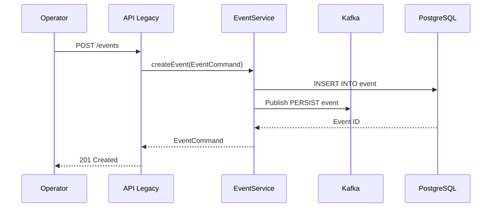

**Blockchain: `IncidentManager.createIncident()`**

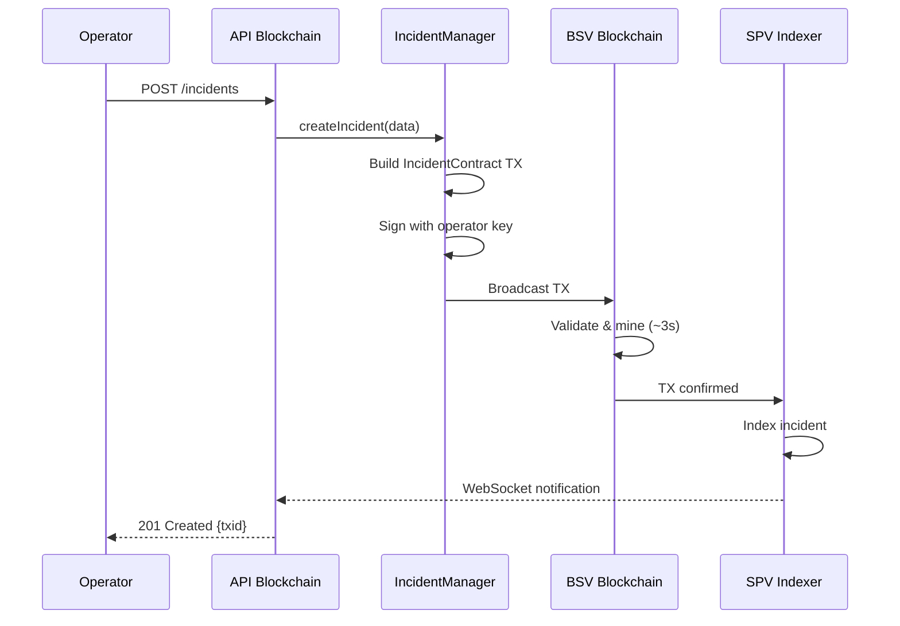

**Mapeo de datos:**

| Campo Legacy | Campo Blockchain | Tipo | Notas |
|-------------|------------------|------|-------|
| `id` (Long) | `txid` (string) | ID único | TXID de la TX de creación |
| `reason` (EventReason) | `reason` (string) | Motivo | Código de motivo (ASSAULT, FIRE, etc.) |
| `priority` (ReasonPriority) | `priority` (number) | Prioridad | 1-5 (1=más alta) |
| `description` (String) | `description` (string) | Descripción | Detalles del incidente |
| `status` (StatusEnum) | `status` (number) | Estado | 0=CREATED, 1=PENDING, ..., 6=CLOSED |
| `createdAt` (LocalDateTime) | `timestamp` (number) | Timestamp | Unix timestamp en ms |
| `createdBy` (AppUser) | `operatorPubKey` (string) | Operador | Public key del operador |
| `eventBranches` (List) | `agencies` (string[]) | Agencias | Array de public keys de agencias |

**Contrato sCrypt simplificado:**

```typescript
class IncidentContract extends SmartContract {
  @prop() readonly incidentId: ByteString;
  @prop() status: bigint;
  @prop() priority: bigint;
  @prop() dataHash: ByteString; // SHA256 de datos completos
  @prop() agencyPubKeys: FixedArray<PubKey, 10>;
  @prop() operatorPubKey: PubKey;
  
  @method()
  public create(sig: Sig, incidentData: ByteString) {
    assert(this.checkSig(sig, this.operatorPubKey));
    assert(this.status == 0n); // CREATED
    assert(sha256(incidentData) == this.dataHash);
    
    const output = this.buildStateOutput(this.buildScript(), 1000n);
    assert(hash256(output) == this.ctx.hashOutputs);
  }
}
```

---

### 2. Update Incident

**Flujo comparativo:**

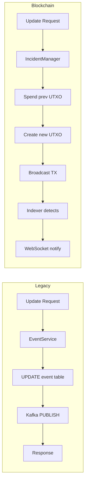

**Diferencias clave:**

| Aspecto | Legacy | Blockchain |
|---------|--------|-----------|
| **Mutabilidad** | Row UPDATE (mutable) | New UTXO (immutable) |
| **Historial** | Requiere EventLog table | Nativo en cadena de TXs |
| **Concurrencia** | Row-level lock | Optimistic (version check) |
| **Rollback** | Transaction rollback | New TX revirtiendo cambio |

---

### 3. Close Incident

**Diagrama de estados:**

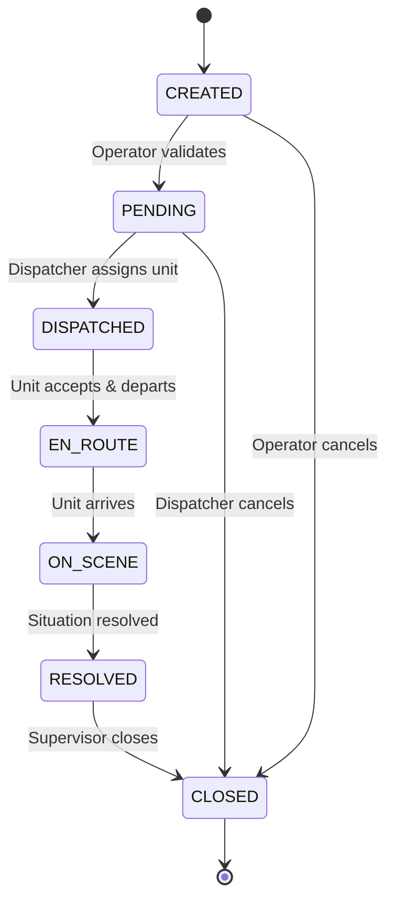

**Legacy: `EventService.closeEvent()`**

```java
public void closeEvent(Long id, String additionalFields, 
                       Long idBranch, String description) {
    Event event = findById(id);
    event.setStatus(StatusEnum.CLOSED);
    event.setDuration(calculateDuration());
    
    ClosureReport report = new ClosureReport();
    report.setEvent(event);
    report.setAdditionalFields(additionalFields);
    
    eventRepository.save(event);
    closureReportRepository.save(report);
    
    eventProducer.sendMessage(eventCommand, "UPDATE");
}
```

**Blockchain: `IncidentManager.closeIncident()`**

```typescript
async closeIncident(
  incidentId: string,
  closureReport: ClosureReport,
  operatorPrivKey: PrivateKey
): Promise<string> {
  // 1. Fetch current incident UTXO
  const currentUtxo = await this.getIncidentUtxo(incidentId);
  
  // 2. Build close transaction
  const tx = new Transaction()
    .addInput(currentUtxo) // Spend current state
    .addOutput(new Transaction.Output({
      script: IncidentContract.buildClosedScript(incidentId),
      satoshis: 1000
    }))
    .addOutput(new Transaction.Output({
      script: Script.buildSafeDataOut(JSON.stringify({
        type: 'INCIDENT_CLOSED',
        incidentId,
        duration: Date.now() - currentUtxo.timestamp,
        closureReport
      })),
      satoshis: 0
    }))
    .sign(operatorPrivKey);
  
  // 3. Broadcast
  const txid = await this.broadcast(tx);
  return txid;
}
```

---

### 4. Split Incident

**Caso de uso:** Un incidente inicial resulta ser dos incidentes separados.

**Diagrama:**

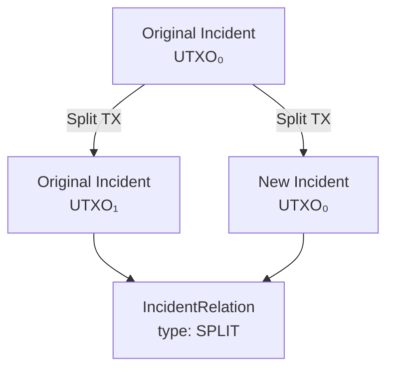

**Transacción atómica:**

```
Inputs:
  [0] Original IncidentContract UTXO
  [1] Funding UTXO (for fees)

Outputs:
  [0] Original IncidentContract UTXO (updated, reference to split)
  [1] New IncidentContract UTXO (cloned data)
  [2] IncidentRelationContract UTXO (type: SPLIT)
  [3] OP_RETURN (split metadata)
  [4] Change UTXO
```

---

### 5. Combine Incidents

**Caso de uso:** Dos incidentes reportados son el mismo evento.

**Diagrama:**

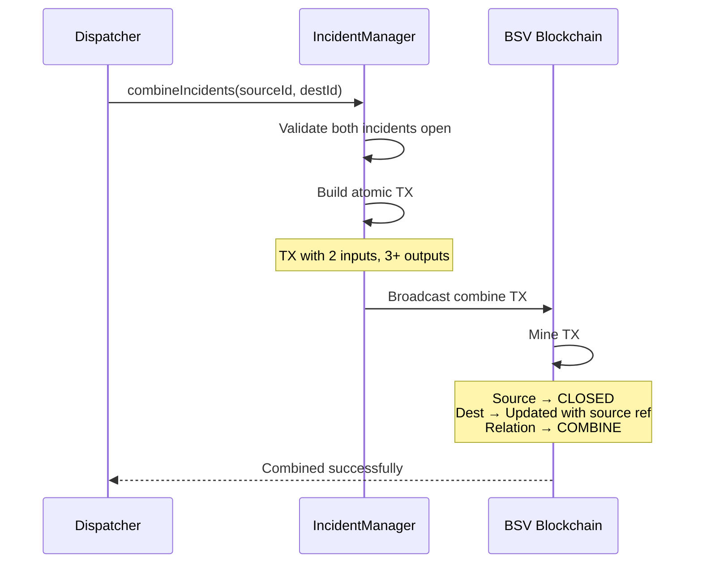

**Validación en contrato:**

```typescript
class IncidentContract extends SmartContract {
  @method()
  public combine(
    sig: Sig,
    sourceIncidentId: ByteString,
    sourceUtxo: UTXO
  ) {
    // Solo dispatcher o supervisor puede combinar
    assert(this.checkSig(sig, this.dispatcherPubKey));
    
    // Ambos incidentes deben estar abiertos
    assert(this.status < 6n);
    assert(sourceUtxo.status < 6n);
    
    // Deben ser del mismo tipo y agencia
    assert(this.reason == sourceUtxo.reason);
    assert(this.agencyPubKeys[0] == sourceUtxo.agencyPubKeys[0]);
    
    // Close source, update destination
    // ... (código de actualización)
  }
}
```

---

### 6. Relate Incidents

**Tipos de relaciones:**

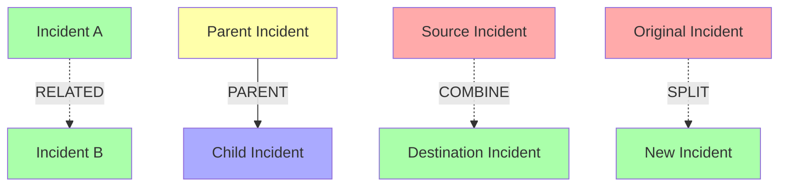

**Contrato IncidentRelationContract:**

```typescript
class IncidentRelationContract extends SmartContract {
  @prop() sourceIncidentId: ByteString;
  @prop() destIncidentId: ByteString;
  @prop() relationType: bigint; // 0=RELATE, 1=PARENT, 2=COMBINE, 3=SPLIT
  @prop() timestamp: bigint;
  @prop() createdBy: PubKey;
  
  @method()
  public create(
    sig: Sig,
    sourceUtxo: UTXO,
    destUtxo: UTXO
  ) {
    assert(this.checkSig(sig, this.createdBy));
    
    // Validar que ambos incidentes existen
    assert(sourceUtxo.incidentId == this.sourceIncidentId);
    assert(destUtxo.incidentId == this.destIncidentId);
    
    // Crear relación
    const output = this.buildStateOutput(this.buildScript(), 1000n);
    assert(hash256(output) == this.ctx.hashOutputs);
  }
}
```

---

## Gestión de recursos

### 7. Dispatch Resource

**Flujo completo:**

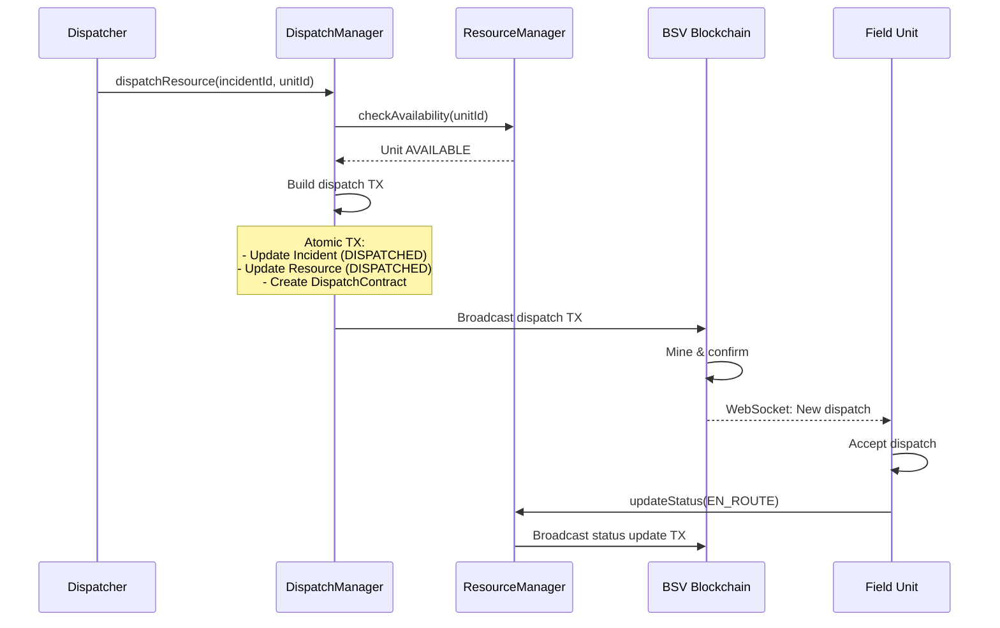

**Estados de recurso:**

| Estado | Código | Descripción | Transiciones permitidas |
|--------|--------|-------------|------------------------|
| AVAILABLE | 0 | Disponible para despacho | → DISPATCHED |
| DISPATCHED | 1 | Asignado a incidente | → EN_ROUTE, AVAILABLE |
| EN_ROUTE | 2 | En camino a la escena | → ON_SCENE, AVAILABLE |
| ON_SCENE | 3 | En la escena del incidente | → AVAILABLE, OUT_OF_SERVICE |
| OUT_OF_SERVICE | 4 | Fuera de servicio | → AVAILABLE |

**ResourceContract:**

```typescript
class ResourceContract extends SmartContract {
  @prop() resourceId: ByteString;
  @prop() resourceType: bigint; // 0=POLICE, 1=AMBULANCE, 2=FIRE
  @prop() status: bigint;
  @prop() currentIncidentId: ByteString; // Empty si no asignado
  @prop() location: GeoLocation;
  @prop() agencyPubKey: PubKey;
  
  @method()
  public dispatch(
    sig: Sig,
    incidentId: ByteString,
    dispatcherPubKey: PubKey
  ) {
    assert(this.checkSig(sig, dispatcherPubKey));
    assert(this.status == 0n); // AVAILABLE
    
    let newState = this;
    newState.status = 1n; // DISPATCHED
    newState.currentIncidentId = incidentId;
    
    const output = newState.buildStateOutput();
    assert(hash256(output) == this.ctx.hashOutputs);
  }
}
```

---

### 8. Update GPS Location

**Alta frecuencia:** Cada unidad actualiza su ubicación cada 30 segundos.

**Optimización batch:**

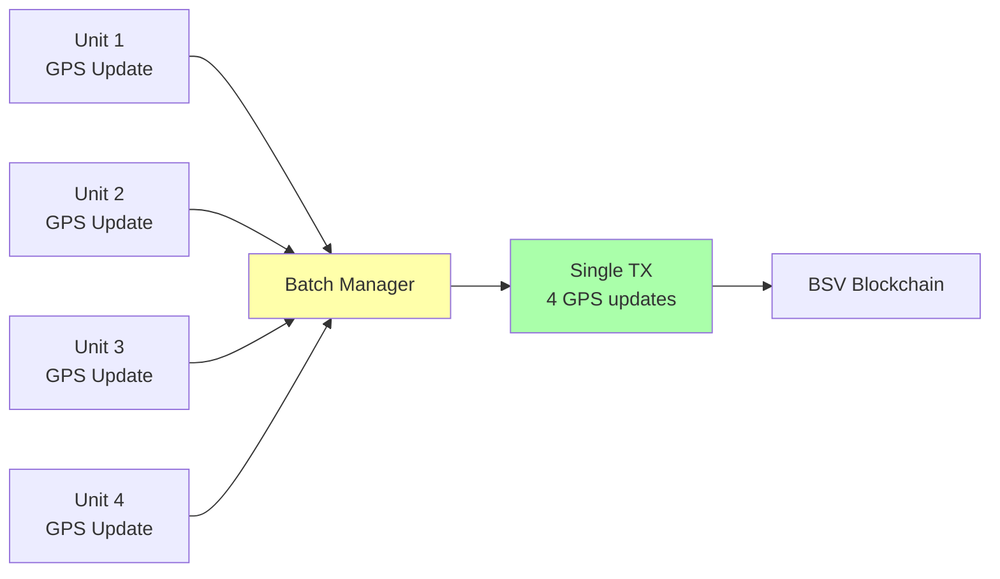

**Transacción batch:**

```
Inputs:
  [0] Resource 1 UTXO
  [1] Resource 2 UTXO
  [2] Resource 3 UTXO
  [3] Resource 4 UTXO
  [4] Funding UTXO

Outputs:
  [0] Resource 1 UTXO (new location)
  [1] Resource 2 UTXO (new location)
  [2] Resource 3 UTXO (new location)
  [3] Resource 4 UTXO (new location)
  [4] OP_RETURN (batch GPS metadata)
  [5] Change UTXO
```

**Costo:**
- Single update: ~$0.0001
- Batch 4 updates: ~$0.0002 (50% savings)
- Batch 10 updates: ~$0.0003 (70% savings)

---

## Interoperabilidad de agencias

### 9. Share Incident with Agency

**Caso de uso:** Incidente cruza límite jurisdiccional, requiere apoyo de otra agencia.

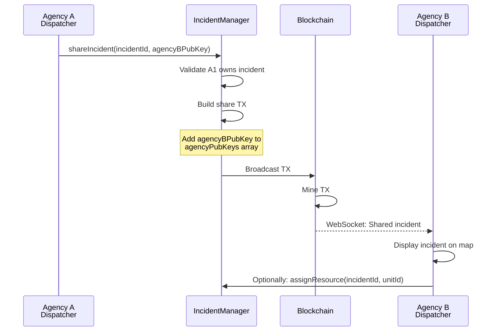

**AgencyContract:**

```typescript
class AgencyContract extends SmartContract {
  @prop() agencyId: ByteString;
  @prop() agencyName: ByteString;
  @prop() agencyPubKey: PubKey;
  @prop() jurisdiction: GeoPolygon; // Límites geográficos
  @prop() sharedIncidents: FixedArray<ByteString, 100>;
  
  @method()
  public shareIncident(
    sig: Sig,
    incidentId: ByteString,
    targetAgencyPubKey: PubKey
  ) {
    assert(this.checkSig(sig, this.agencyPubKey));
    
    // Agregar a lista de compartidos
    let newState = this;
    // ... (lógica de agregar)
    
    const output = newState.buildStateOutput();
    assert(hash256(output) == this.ctx.hashOutputs);
  }
}
```

---

### 10. Transfer Incident

**Diferencia con Share:** Transfer transfiere completamente el ownership.

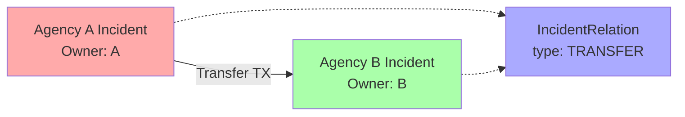

**Validación multi-firma:**

```typescript
@method()
public transfer(
  sigSource: Sig,
  sigDest: Sig,
  sourceAgencyPubKey: PubKey,
  destAgencyPubKey: PubKey
) {
  // Requiere firma de ambas agencias
  assert(this.checkSig(sigSource, sourceAgencyPubKey));
  assert(this.checkSig(sigDest, destAgencyPubKey));
  
  // Cambiar ownership
  let newState = this;
  newState.agencyPubKeys[0] = destAgencyPubKey;
  
  const output = newState.buildStateOutput();
  assert(hash256(output) == this.ctx.hashOutputs);
}
```

---

## Workflows y permisos

### 11. Operator vs Supervisor Permissions

**Matriz de permisos:**

| Acción | Operator | Supervisor | Admin |
|--------|----------|-----------|-------|
| Create incident | ✅ | ✅ | ✅ |
| Update incident | ✅ (own) | ✅ (any) | ✅ (any) |
| Close incident | ❌ | ✅ | ✅ |
| Reopen incident | ❌ | ✅ | ✅ |
| Dispatch resource | ❌ | ✅ | ✅ |
| Combine incidents | ❌ | ✅ | ✅ |
| Share with agency | ❌ | ✅ | ✅ |
| Transfer to agency | ❌ | ❌ | ✅ |

**Implementación en contrato:**

```typescript
class IncidentContract extends SmartContract {
  @prop() operatorPubKey: PubKey;
  @prop() supervisorPubKeys: FixedArray<PubKey, 5>;
  @prop() adminPubKey: PubKey;
  
  @method()
  validatePermission(sig: Sig, action: bigint): boolean {
    switch (action) {
      case 0n: // CREATE
        return this.checkSig(sig, this.operatorPubKey) ||
               this.checkAnySig(sig, this.supervisorPubKeys) ||
               this.checkSig(sig, this.adminPubKey);
      
      case 1n: // UPDATE
        // Similar logic
        
      case 2n: // CLOSE
        return this.checkAnySig(sig, this.supervisorPubKeys) ||
               this.checkSig(sig, this.adminPubKey);
      
      // ... más acciones
    }
  }
}
```

---

## Integración IoT

### 12. Panic Button → Auto-create Incident

**Flujo:**

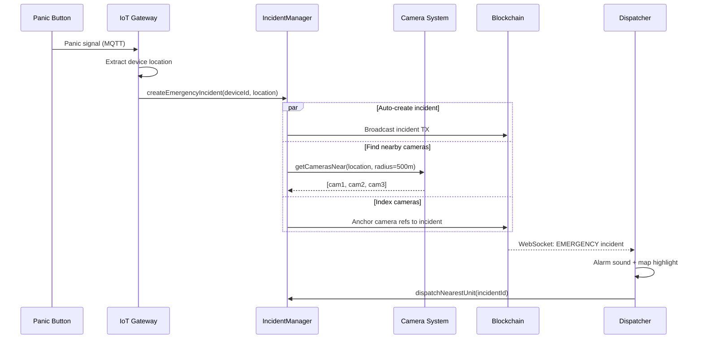

**Incident metadata IoT:**

```json
{
  "type": "INCIDENT_CREATED",
  "origin": "PANIC_BUTTON",
  "deviceId": "PB-12345",
  "location": {
    "lat": 19.432608,
    "lng": -99.133209,
    "accuracy": 5
  },
  "priority": 1,
  "reason": "EMERGENCY_PANIC",
  "nearbyCameras": [
    {
      "cameraId": "CAM-001",
      "distance": 50,
      "videoUrl": "uhrp://..."
    },
    {
      "cameraId": "CAM-002",
      "distance": 120,
      "videoUrl": "uhrp://..."
    }
  ],
  "autoDispatch": true
}
```

---

## Funciones implementadas, no incluidas en el mapeo legacy

Estas funciones ya existen en el código (`IncidentManager`, `DispatchManager`, `ResourceManager`) pero no
tienen equivalente directo en el sistema legacy — son capacidades nuevas habilitadas por blockchain, o
funciones de soporte que faltaban en las secciones 1-12. `reopenIncident` aparece en la tabla maestra
(fila 4) pero nunca tuvo su propio diagrama — se documenta aquí por primera vez.

### 13. Reopen Incident

**`IncidentManager.reopenIncident(incidentId: string, supervisorPrivKey: PrivateKey): Promise<string>`**

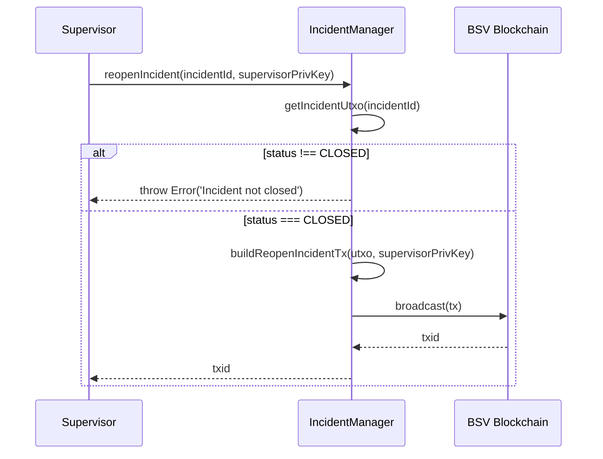

### 14. Add Field Notes

**`IncidentManager.addFieldNotes(incidentId: string, notes: any, operatorPrivKey: PrivateKey): Promise<string>`**

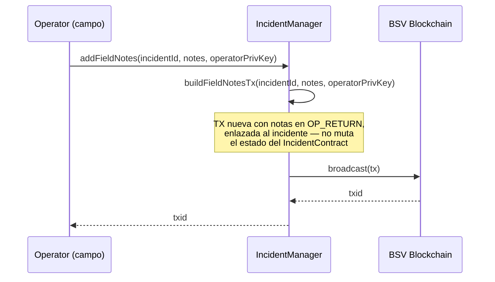

### 15. Auto-Dispatch

**`DispatchManager.autoDispatch(incidentId: string, resourceType: number): Promise<string>`**

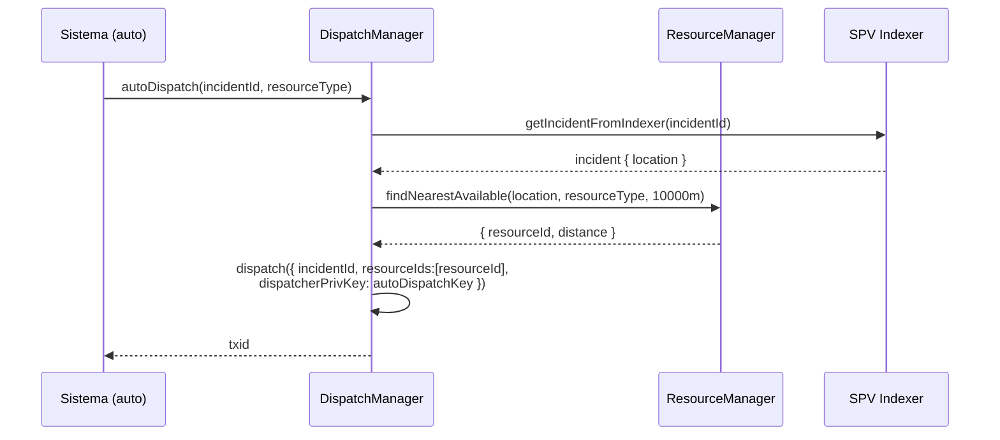

> Usa una clave de auto-dispatch dedicada (`getAutoDispatchKey()`) — en producción debe ser una clave
> de sistema separada de cualquier operador humano, auditable por separado.

### 16. Cancel Dispatch

**`DispatchManager.cancelDispatch(dispatchId: string, dispatcherPrivKey: PrivateKey): Promise<string>`**

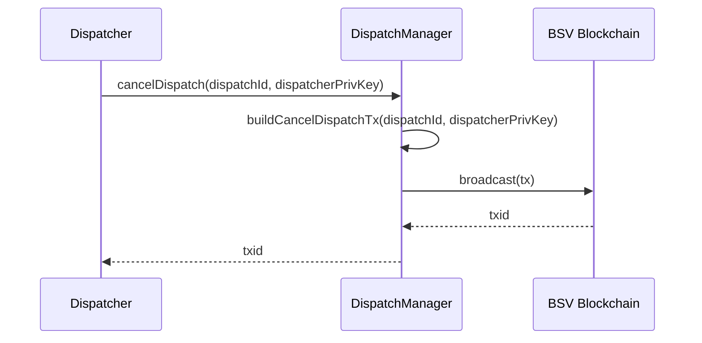

### 17. Resource: Update Status / Batch GPS / Find Nearest / Release

Cuatro funciones de soporte en `ResourceManager`, agrupadas porque comparten la misma forma
(fetch resource → build tx → broadcast) salvo `findNearestAvailable`, que es de solo lectura:

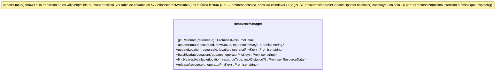

---

## Resumen de mapeo

### Tabla maestra: Legacy → Blockchain

| # | Función Legacy | Función Blockchain | Contrato | Complejidad |
|---|---------------|-------------------|----------|-------------|
| 1 | `createEvent` | `createIncident` | IncidentContract | Media |
| 2 | `updateEvent` | `updateIncident` | IncidentContract | Media |
| 3 | `closeEvent` | `closeIncident` | IncidentContract | Media |
| 4 | `reopenEvent` | `reopenIncident` | IncidentContract | Baja |
| 5 | `splitEvent` | `splitIncident` | Incident + Relation | Alta |
| 6 | `combineEvent` | `combineIncidents` | Incident + Relation | Alta |
| 7 | `relateEvent` | `relateIncidents` | IncidentRelation | Media |
| 8 | `extendEvent` | `extendIncident` | Incident + Relation | Media |
| 9 | `assignBranches` | `shareIncident` | Agency | Media |
| 10 | `unassignBranches` | `unshareIncident` | Agency | Media |
| 11 | N/A (nuevo) | `dispatchResource` | Resource + Dispatch | Alta |
| 12 | N/A (nuevo) | `updateGPS` | Resource | Baja |
| 13 | N/A (nuevo) | `transferIncident` | Agency + Relation | Alta |
| 14 | N/A (nuevo) | `panicButtonIncident` | Incident + IoT | Media |

**Total de contratos:**
- IncidentContract: 1
- ResourceContract: 1
- DispatchContract: 1
- AgencyContract: 1
- IncidentRelationContract: 1
- **Total: 5 contratos sCrypt**

---

**Siguiente:** [README-test-scenarios.md](./readme-test-scenarios.md) - Escenarios de prueba detallados
